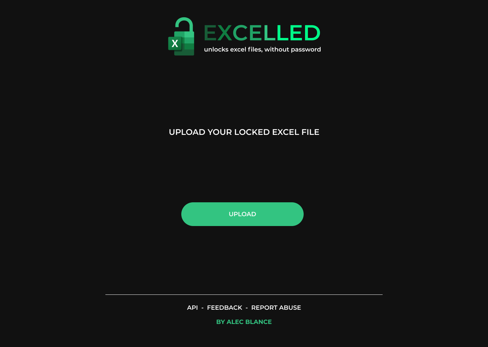
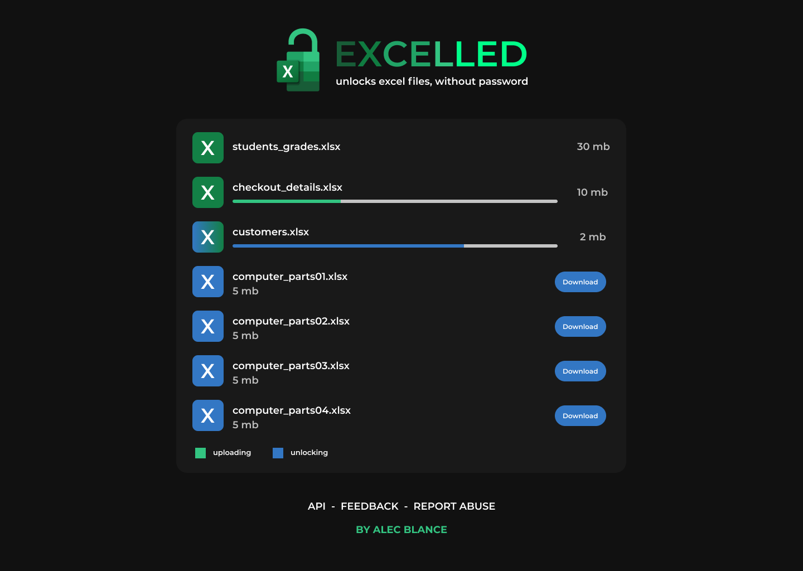

# Excelled (on development)
 

  

  <h3 align="center">Excelled</h3>

  

    Excelled unprotects excel files without password. 
     
     
    <a href="https://youtu.be/v-O-r5LoX_E">View Demo</a>
    ·
    <a href="https://github.com/AlecBlance/Excelled/issues">Report Bug</a>
    ·
    <a href="https://github.com/AlecBlance/Excelled/issues">Request Feature</a>
  

### Download
https://github.com/AlecBlance/Excelled/releases/download/v1.0/excelled.exe

### Upcoming update
- Excelled website

 

#### Tentative look
- Homepage

  

- Processing

  

